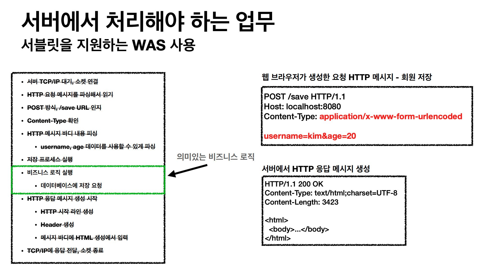
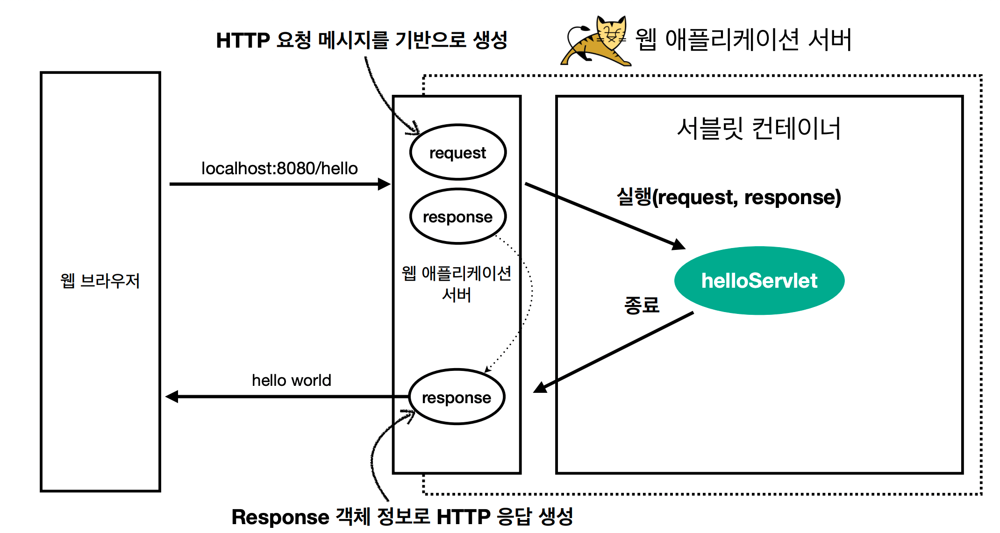

# 서블릿(Servlet)이란?
- 동적 웹 페이지를 만들 때 사용되는 자바 기반의 웹 애플리케이션 프로그래밍 기술이다. 서블릿은 웹 요청과 응답의 흐름을 간단한 메서드 호출만으로 체계적으로 다룰 수 있게 해준다.




```java
@WebServlet(name = "helloServlet", urlPatterns = "/hello")
public class HelloServlet extends HttpServlet {
 @Override
 protected void service(HttpServletRequest request, HttpServletResponse response){
 //애플리케이션 로직
 }
}
```

- urlPatterns(/hello)의 URL이 호출되면 서블릿 코드가 실행
- HTTP 요청 정보를 편리하게 사용할 수 있는 HttpServletRequest
- HTTP 응답 정보를 편리하게 제공할 수 있는 HttpServletResponse
- 개발자는 HTTP 스펙을 매우 편리하게 사용


# HTTP 요청시
- WAS는 Request, Response 객체를 새로 만들어서 서블릿 객체 호출
- 개발자는 Request 객체에서 HTTP 요청 정보를 편리하게 꺼내서 사용
- 개발자는 Response 객체에 HTTP 응답 정보를 편리하게 입력
- WAS는 Response 객체에 담겨있는 내용으로 HTTP 응답 정보를 생성

# 서블릿 컨테이너
- 톰캣처럼 서블릿을 지원하는 WAS를 서블릿 컨테이너라고 함
- 서블릿 컨테이너는 서블릿 객체를 생성, 초기화, 호출, 종료하는 생명주기 관리
- 서블릿 객체는 싱글톤으로 관리
    - 고객의 요청이 올 때 마다 계속 객체를 생성하는 것은 비효율
    - 최초 로딩 시점에 서블릿 객체를 미리 만들어두고 재활용
    - 모든 고객 요청은 동일한 서블릿 객체 인스턴스에 접근
- 공유 변수 사용 주의 *** <- 이부분 때문에 이슈가 발생 많이함
    - 서블릿 컨테이너 종료시 함께 종료
    - JSP도 서블릿으로 변환 되어서 사용
- 동시 요청을 위한 멀티 쓰레드 처리 지원
